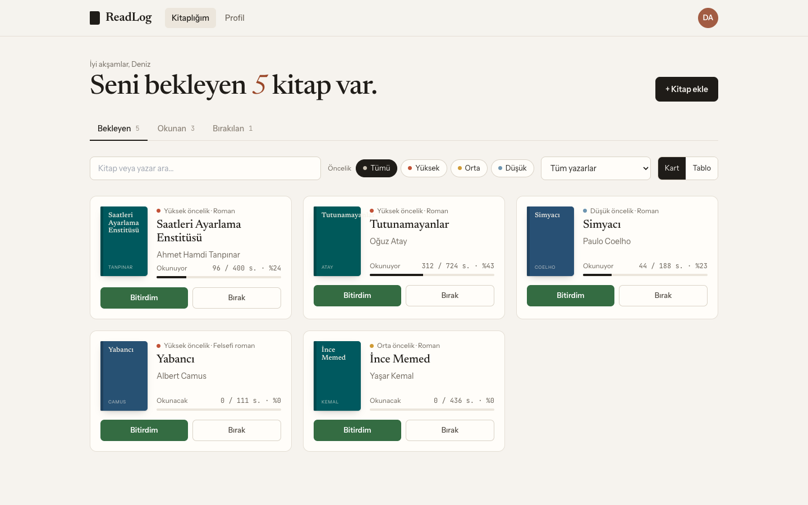
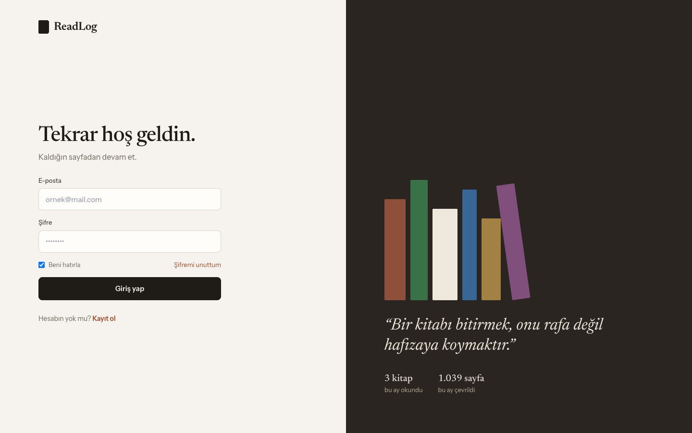
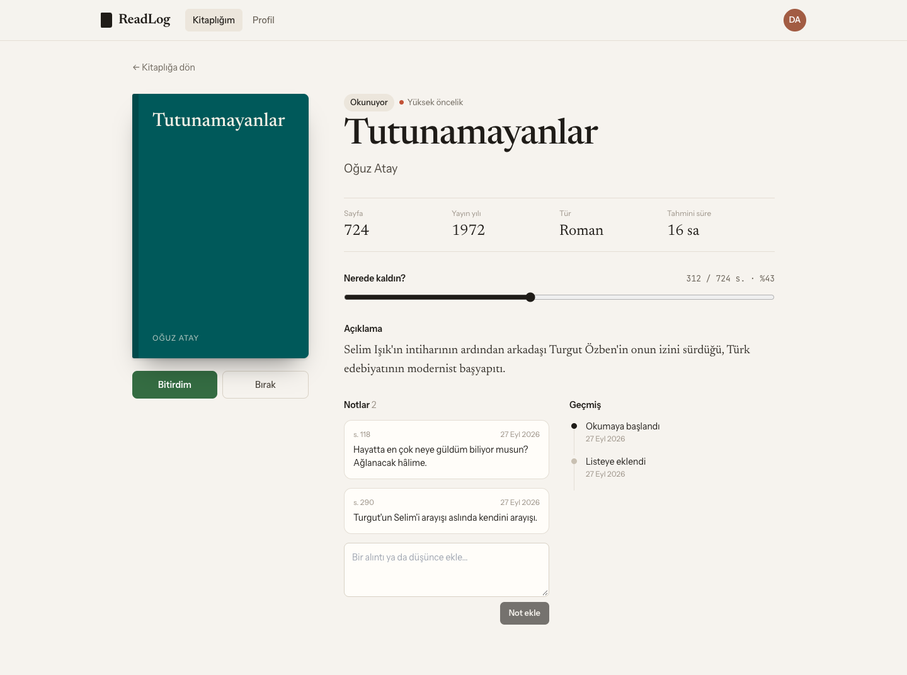
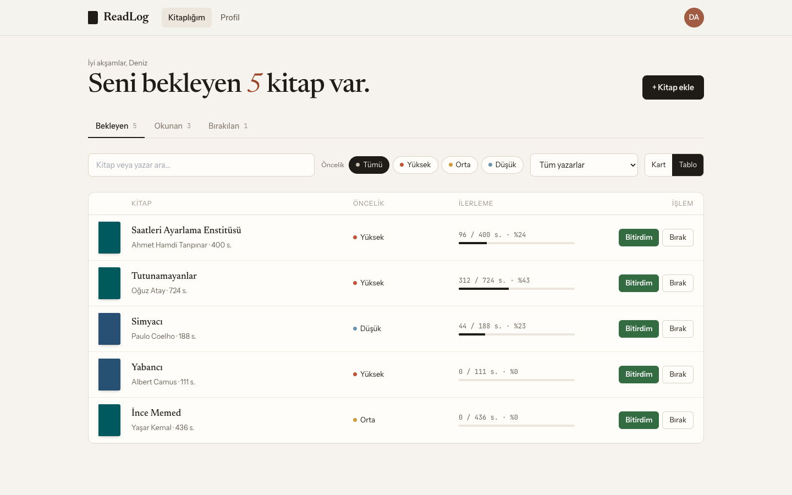
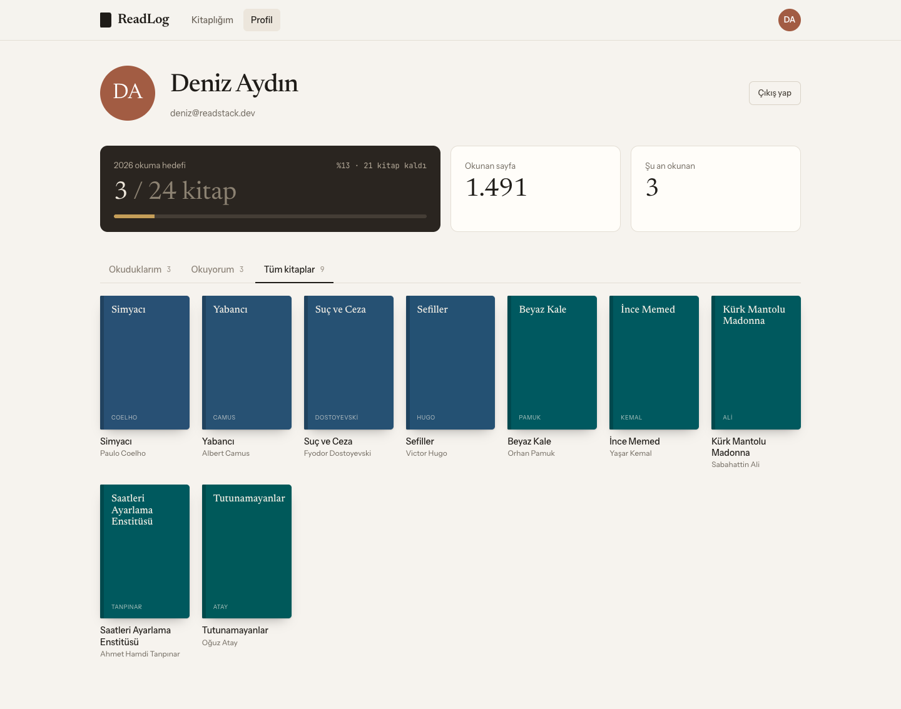
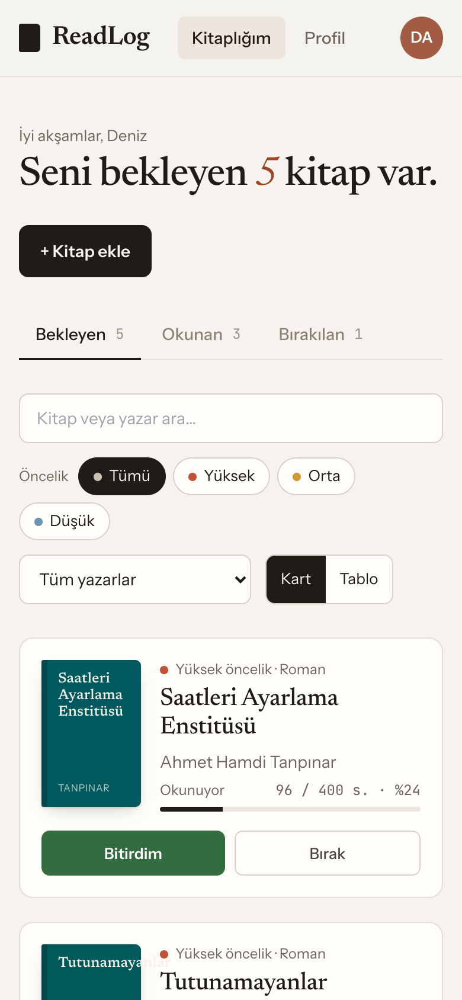

# ReadStack

Okuduğun ve okuyacağın kitapları takip ettiğin bir okuma listesi uygulaması.



## Özellikler

- Kayıt, giriş, şifre sıfırlama (JWT + otomatik token yenileme)
- Kitap ekleme, arama, öncelik ve yazar filtresi
- Kart ve tablo görünümü, "Bitirdim / Bırak" ve geri alma
- Kitap detayında ilerleme, notlar ve geçmiş
- Profilde yıllık okuma hedefi ve raf
- Mobil uyumlu arayüz

## Ekran Görüntüleri

| Giriş | Kitap detayı |
|---|---|
|  |  |
| **Tablo görünümü** | **Profil** |
|  |  |



## Teknolojiler

**Frontend:** Next.js 14, React 18, TanStack React Query, Axios, Tailwind CSS

**Backend:** Node.js, Express 5, MongoDB, Mongoose, JWT, bcryptjs

**Altyapı:** Docker Compose (MongoDB)

## Kurulum

```bash
docker compose up -d

cd server
cp .env.example .env
npm install
npm run dev

cd ../client
cp .env.local.example .env.local
npm install
npm run dev
```

Uygulama `http://localhost:3000`, API `http://localhost:5050/api` adresinde çalışır.

## API

| Uç nokta | Açıklama |
|---|---|
| `/api/auth` | register, login, refresh, logout, forgot-password, reset-password, me |
| `/api/prs` | Kitap listeleme, ekleme, durum, ilerleme ve not işlemleri (korumalı) |
| `/api/stats/monthly` | Bu ay okunan kitap ve sayfa sayısı |

Hatalar `{ "error": "mesaj" }` biçiminde döner.
